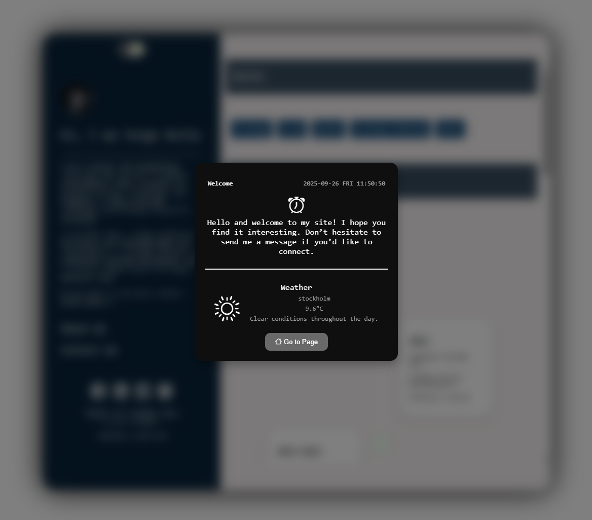
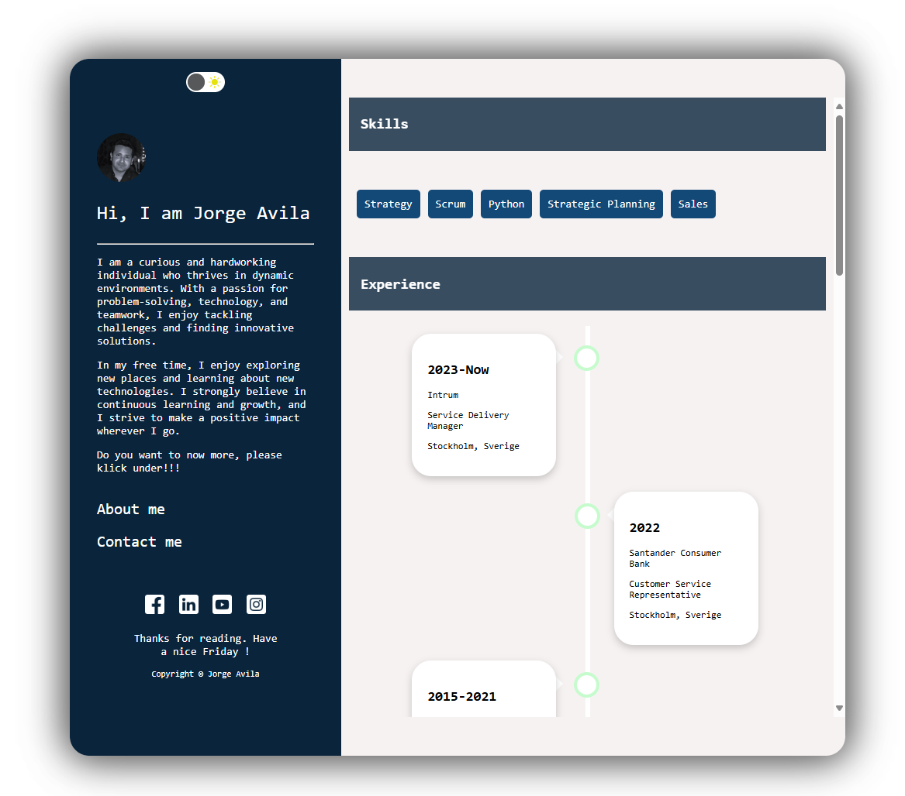

<h1 align='center'>Homepage – Digital CV 💼</h1>

<p align="center">A personal homepage built with HTML, CSS, and JavaScript, designed to function as a digital CV/portfolio. It presents professional information, skills, and projects in a clean, responsive layout.</p>

---

## Features

- 👤 About me section – short professional introduction
- 📑 CV/Resume layout – education, work experience, and skills
- 🛠️ Projects/Portfolio – highlights of previous work
- 📱 Responsive design – optimized for desktop and mobile
- 🚀 Deployable on GitHub Pages for easy sharing

---

## Technologies

- HTML5 – semantic structure
- CSS3 – styling and responsive layout
- JavaScript (ES6+) – interactivity
- GitHub Pages – hosting and deployment

---

## Project Structure

```
homepage/
├── assets/          # Images, icons, CV-related media
├── css/             # Stylesheets
├── js/              # JavaScript files
├── screenshots/     # Screenshots use in README
├── index.html       # Main homepage (digital CV)
└── README.md        # Documentation
```

---

## Installation

1. Clone the repository:

```
git clone https://github.com/Jojje84/homepage.git
cd homepage
```

2. Open the project in your browser:

- Double-click on index.html
- Or serve it locally with a lightweight server (e.g., Live Server in VS Code).

## Deployment with GitHub Pages

1. Go to your repository settings: Settings → Pages

2. Under Build and deployment select:

   - Branch: main
   - Folder: /root

3. Click Save

4. Your digital CV will be available at:

```
https://jojje84.github.io/homepage/
```

---

## Screenshots

- Homepage-widget 

- Homepage 

---

## Contact

👤 Jorge

[](https://github.com/Jojje84)  
[](mailto:jorgeavilas@icloud.com)
[](https://www.linkedin.com/in/jorge-avila-35622030/)
